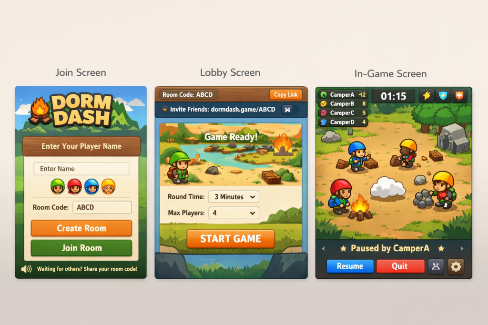

# Dorm Dash - Multiplayer Game



## Overview
**Dorm Dash** is a real-time multiplayer browser game built for high performance and engaging gameplay. The project relies on a strictly DOM+CSS based rendering engine (no `<canvas>`) to deliver a fully responsive 60 FPS experience, seamlessly connected to a real-time WebSocket backend. 

Players join a room, select a colored avatar, and enter a forest camp compound where they must navigate their character, collect embers to score points, avoid dangerous rainclouds, and use powerups. 

---

## 🎮 How to Play

### Joining the Game
1. **Name & Avatar:** On the main join screen, enter your player name and select a colored camper (Green, Red, Blue, or Yellow).
2. **Room Code:** Enter a 4-letter Room Code (e.g., `ABCD`) to join an existing lobby or create a new one.


### The Lobby
- Once in the lobby, you'll see a preview of the arena and all the connected players.
- You can copy the room link and share it with your friends to invite them.
- If you are the Host (the first person to create the room), you can start the game once everyone is ready!

### In-Game Mechanics
- **Movement:** Use the `W, A, S, D` keys, the `Arrow Keys`, or the on-screen mobile D-Pad to move your camper around the dirt compound.
- **Goal:** Run over the flickering **embers** that spawn around the map to collect them. Each ember gives you points.
- **Hazards:** Avoid the **rainclouds**! Getting struck by them can stun you or deduct points.
- **Timer:** Keep an eye on the top center clock. The game lasts for a specific duration (default 3 minutes). The player with the most points when the timer runs out wins!


### Pause Menu
- Press `Escape` (or the gear icon on the bottom right) to pause the game. From here, you can toggle game audio, resume, or quit back to the main menu.

### End of Game
- When the timer expires, the screen shifts to the final scoreboard, crowning the winner with a shower of confetti!
- Players who click **Play Again** will enter a waiting state. If the Host clicks **Play Again**, everyone who chose to wait will be seamlessly dropped back into the Lobby for another round!


---

## Architecture & Technology Stack
The application is structured into two primary domains to ensure a clean separation of concerns:

- **Frontend (`/client`)**: A Vanilla JS application utilizing a custom DOM entity pool for zero garbage-collection layout rendering. It handles all visual rendering, CSS animations, sound playback, player input mapping, and responsive UI scaling. Uses **HTML5, CSS3, and ES6 JavaScript**.
- **Backend (Server)**: An authoritative WebSocket server responsible for managing lobbies, executing the game loop simulation (typically at 20Hz), handling bot AI routing, collision detection, and score management. 
  - *Note: A local mock server (`client/ws-mock.js`) is currently provided for frontend development and visual testing, but the architecture is fully decoupled.*

## Local Development Setup

The backend has been fully implemented using Node.js. It now handles both the WebSocket real-time simulation and serving the static frontend files!

### Quick Start
To start the game, simply run the included run script from the root directory:
```bash
./run.sh
```
Then navigate your web browser to `http://localhost:3000`.

### Manual Start
Alternatively, you can start the server manually:
```bash
cd server
npm install
npm start
```

## Backend Implementation Guide
The backend runs an authoritative 20Hz physics simulation for collisions and movement. Backend engineers should refer directly to **`BACKEND_CONTRACT.md`** for the exact WebSocket event schemas. The frontend is entirely "dumb" to game rules—it strictly renders whatever state the server broadcasts. 

The backend is strictly responsible for:
- **Lobby Management**: Handling `join_room` requests and broadcasting `room_update` state changes.
- **Game State Simulation**: Processing player `input` (movement directions) and broadcasting continuous `state_delta` ticks at roughly 20Hz.
- **Collisions & Entities**: The server dictates when an ember is collected or a cloud strikes a player, and manages the spawning coordinates of all entities.

## Performance Constraints
- **Zero Canvas**: The entire game is rendered using DOM elements and hardware-accelerated CSS transforms (`translate3d`). No `<canvas>` elements are permitted.
- **Object Pooling**: DOM nodes are pre-allocated at startup. To maintain 60 FPS, no elements should be created or destroyed inside the `requestAnimationFrame` loop.
